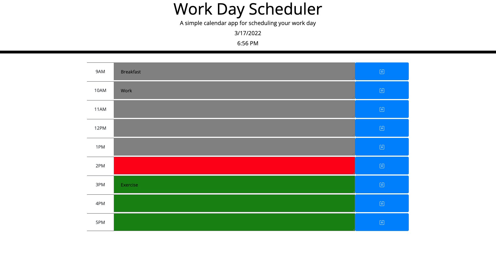

# Work Day Scheduler

This project allows users to add and remove tasks from a calender. The tasks are saved in localStorage. The hour blocks also change colors based on how close each one is to the current time.

## Technologies

This project uses HTML, CSS, and Javascript along with Bootstrap and JQuery.

## Screenshots

